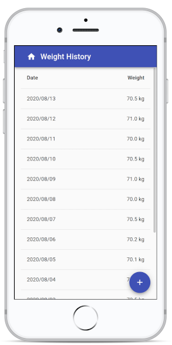

# weight-logger-pwa

<p align="center">
<a href="./img/screenshot.png"></a><br/>
Body Weight Logger with minimalistic UI
</p>

Reading is great for learning, but it can only take you so far. This app is a place to put things into practice.

Things I want to try:

- Material Design + Material UI
- "bring your own storage": This app won't have it's own cloud backend.
  Instead it will rely on existing cloud accounts such as NextCloud, Dropbox, Google Drive, OneDrive.
  Inspiration: draw.io, KeeWeb. File format will be something text based, potentially compressed.
- CSS-in-JS, because Material UI comes with that and haven't had a chance to try out whether it's a good concept
- react-router
- animated transitions, along the lines of what Material Design guidelines suggest
- Progressive Web Apps: let's see how far they can take us
- Writing out the decision making process

## TODO

- complete CRUD screens and integrate w redux state
- test reducers
- <del>install redux</del>
- <del>Outline structure of the app state</del>
- <del>research local storage options</del> -> use IndexedDB
- <del>tests for chart utility functions</del>
- <del>Simple home screen chart</del>
- CSV <del>parser</del>, <del>writer</del>

## Decisions

### State

```
- Weight log entries
- Index of the entry being edited
- Storage connections: to IndexedDB, Dropbox, NextCloud
```

#### Actions

```
 - add log entry [entry data]
 - update log entry [entry index, data]
 - delete log entry [entry index]
 - loaded log entries [list of entries]
 - connect storage [type]
 - import/export

```

### Is text based file storage viable?

#### Why is this a concern?

Having dumb text files as a storage will require transferring the whole file on each change.
WebDAV and other APIs don't seem to support any partial file transfers.

#### Numbers:

Data point (datetime+weight)

```js
new Date().toISOString().length; // 24
```

Entry length = 24 (datetime) + 1 (comma) + 5 (weight) + 1 (new line)
= 31 bytes

Year worth of daily entries = 11 kB.

#### Conclusion

CSV is completely ok for this.

### Why React and create-react-app?

React and JSX feel like a very natural extension of HTML and JS.

### Dropbox integration

- Oauth2
- https://developer.mozilla.org/en-US/docs/Web/API/Crypto/subtle (SHA256, random values)
- https://www.dropbox.com/lp/developers/reference/oauth-guide

## Significant takeaways / things I didn't expect / things I learned

### Composability of Material UI

In the beginning it bothered me that Material UI didn't come with premade common screen layouts. Assumption
was that components that the AppBar, Floating Action Button and the main body of the app need to be composed
in a specific way to look ok. This assumption is wrong. In the age of flexbox layout things got much simpler. Correct
paddings and vertical stretching are much easier to achieve nowadays. The components of Material UI are mostly
self contained. They don't have margins outside and they are easy to position
by wrapping them in a parent div with correct positioning attributes.

## create-react-app

This project was bootstrapped with [Create React App](https://github.com/facebook/create-react-app).

## Available Scripts

In the project directory, you can run:

### `npm start`

Runs the app in the development mode.<br />
Open [http://localhost:3000](http://localhost:3000) to view it in the browser.

The page will reload if you make edits.<br />
You will also see any lint errors in the console.

### `npm test`

Launches the test runner in the interactive watch mode.<br />
See the section about [running tests](https://facebook.github.io/create-react-app/docs/running-tests) for more information.

### `npm run build`

Builds the app for production to the `build` folder.<br />
It correctly bundles React in production mode and optimizes the build for the best performance.

The build is minified and the filenames include the hashes.<br />
Your app is ready to be deployed!

See the section about [deployment](https://facebook.github.io/create-react-app/docs/deployment) for more information.
